# InsightFlow

> **An event-driven analytics platform for processing large datasets.**  
> **Tagline:** Upload. Process. Analyze. Scale.

InsightFlow is a microservices-based analytics platform designed to process large CSV/Excel datasets asynchronously. The platform separates ingestion, processing, analytics, and reporting concerns so that expensive dataset processing does not block API requests.

The architecture emphasizes reliability and scalability through:

- Asynchronous event-driven processing
- Transactional outbox pattern
- Idempotent event consumption
- RabbitMQ retries and dead-letter handling
- Redis caching and rate limiting
- Horizontally scalable workers
- PostgreSQL-backed metadata and analytics results
- Docker-based deployment

---

## Table of Contents

1. [Overview](#overview)
2. [Problem Statement](#problem-statement)
3. [Goals and Requirements](#goals-and-requirements)
4. [Architecture](#architecture)
5. [Service Responsibilities](#service-responsibilities)
6. [End-to-End Data Flow](#end-to-end-data-flow)
7. [Authentication and API Gateway](#authentication-and-api-gateway)
8. [Dataset Ingestion](#dataset-ingestion)
9. [Transactional Outbox](#transactional-outbox)
10. [RabbitMQ Messaging](#rabbitmq-messaging)
11. [Idempotency](#idempotency)
12. [Retry and Dead-Letter Handling](#retry-and-dead-letter-handling)
13. [Analytics Processing](#analytics-processing)
14. [Data Quality](#data-quality)
15. [Redis Caching](#redis-caching)
16. [Rate Limiting](#rate-limiting)
17. [Database Ownership](#database-ownership)
18. [API Reference](#api-reference)
19. [Project Structure](#project-structure)
20. [Non-Functional Requirements](#non-functional-requirements)
21. [Failure Scenarios](#failure-scenarios)
22. [Deployment](#deployment)

---

## Overview

InsightFlow accepts datasets, stores their metadata, creates processing jobs, and publishes processing events asynchronously.

The worker consumes those events, processes the dataset, calculates analytics, persists the result, and acknowledges the RabbitMQ message only after successful processing.

This prevents long-running CSV processing from blocking the request-response cycle.

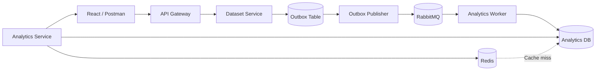
```mermaid
flowchart LR
    Client[React / Postman]
    Gateway[API Gateway]
    Dataset[Dataset Service]
    Outbox[(Outbox Table)]
    Publisher[Outbox Publisher]
    MQ[(RabbitMQ)]
    Worker[Analytics Worker]
    AnalyticsDB[(Analytics DB)]
    AnalyticsAPI[Analytics Service]
    Redis[(Redis)]

    Client --> Gateway
    Gateway --> Dataset
    Dataset --> Outbox
    Outbox --> Publisher
    Publisher --> MQ
    MQ --> Worker
    Worker --> AnalyticsDB
    AnalyticsAPI --> AnalyticsDB
    AnalyticsAPI --> Redis
    Redis -. Cache miss .-> AnalyticsDB
    AnalyticsAPI --> Client
```

---

## Problem Statement

Organizations frequently receive CSV/Excel files containing sales, employee, financial, customer, or other business data.

A synchronous processing model creates several problems:

- Large files make API requests slow.
- Processing consumes application resources for a long time.
- Temporary failures can cause the complete request to fail.
- Duplicate message delivery can result in duplicate processing.
- External infrastructure failures can interrupt processing.
- Increasing traffic requires scaling the API and processing workloads independently.

InsightFlow addresses these problems by moving dataset processing to an asynchronous event-driven workflow.

---

# Goals and Requirements

## Functional Requirements

### Authentication

- User registration
- Login
- JWT authentication
- Refresh token
- User profile

### Dataset Management

- Upload CSV
- Upload Excel
- View uploaded datasets
- Delete datasets
- Dataset versioning

### Processing

When a dataset is uploaded:

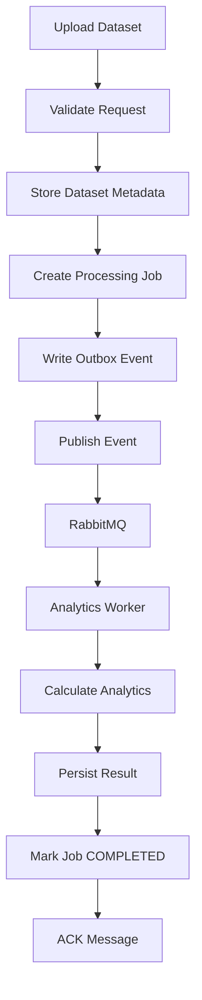
```mermaid
flowchart TD
    A[Upload Dataset] --> B[Validate Request]
    B --> C[Store Dataset Metadata]
    C --> D[Create Processing Job]
    D --> E[Write Outbox Event]
    E --> F[Publish Event]
    F --> G[RabbitMQ]
    G --> H[Analytics Worker]
    H --> I[Calculate Analytics]
    I --> J[Persist Result]
    J --> K[Mark Job COMPLETED]
    K --> L[ACK Message]
```

### Analytics

The platform generates:

- Total rows
- Total columns
- Missing values
- Duplicate rows
- Numeric statistics
- Top categories
- Correlation
- Histograms
- Data-quality score

### Reports

Supported output concepts include:

- PDF
- JSON
- Dashboard
- Clean CSV download

### Notifications

Processing lifecycle events include:

- Processing started
- Processing completed
- Processing failed

### Dashboard

The dashboard can expose:

- Uploaded datasets
- Processing jobs
- Queue status
- Failed jobs
- Completed reports

---

# Architecture

## High-Level Architecture

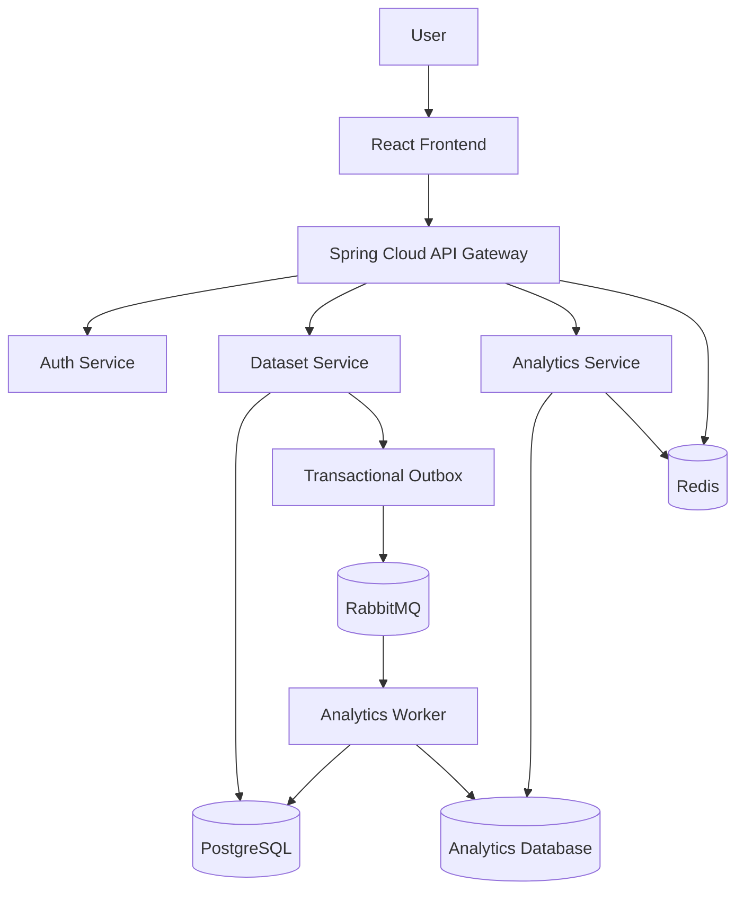
```mermaid
flowchart TB
    User[User]
    Frontend[React Frontend]
    Gateway[Spring Cloud API Gateway]

    Auth[Auth Service]
    Dataset[Dataset Service]
    Analytics[Analytics Service]
    Worker[Analytics Worker]

    Postgres[(PostgreSQL)]
    AnalyticsDB[(Analytics Database)]
    Redis[(Redis)]
    RabbitMQ[(RabbitMQ)]

    User --> Frontend
    Frontend --> Gateway

    Gateway --> Auth
    Gateway --> Dataset
    Gateway --> Analytics

    Dataset --> Postgres
    Dataset --> Outbox[Transactional Outbox]
    Outbox --> RabbitMQ

    RabbitMQ --> Worker
    Worker --> Postgres
    Worker --> AnalyticsDB

    Analytics --> AnalyticsDB
    Analytics --> Redis

    Gateway --> Redis
```

### Architectural Principles

| Principle | Purpose |
|---|---|
| API Gateway | Single entry point for clients |
| Microservices | Independent service ownership and scaling |
| Async processing | Prevent long-running work from blocking APIs |
| RabbitMQ | Reliable event delivery |
| Outbox pattern | Avoid DB/event publication inconsistency |
| Idempotency | Safely handle duplicate deliveries |
| Retry | Recover from transient failures |
| DLQ | Isolate messages that repeatedly fail |
| Redis | Cache frequently requested analytics |
| Rate limiting | Protect APIs from excessive traffic |

---

# Service Responsibilities

## API Gateway

Responsible for:

- Routing client requests
- JWT authentication filtering
- Rate limiting
- Exposing a unified API entry point

## Auth Service

Responsible for:

- Registration
- Login
- JWT generation
- Refresh-token flow
- User profile operations

## Dataset Service

Responsible for:

- Dataset upload
- Dataset metadata
- Dataset lifecycle
- Processing-job creation
- Outbox event creation
- Clean CSV download

## Analytics Worker

Responsible for:

- Consuming processing events
- Claiming processing jobs
- Reading dataset files
- Parsing CSV data
- Calculating analytics
- Persisting analytics results
- Updating processing status
- Acknowledging RabbitMQ messages

## Analytics Service

Responsible for:

- Reading analytics results
- Returning dataset summaries
- Returning column analytics
- Serving dashboard data
- Using Redis for caching

---

# End-to-End Data Flow

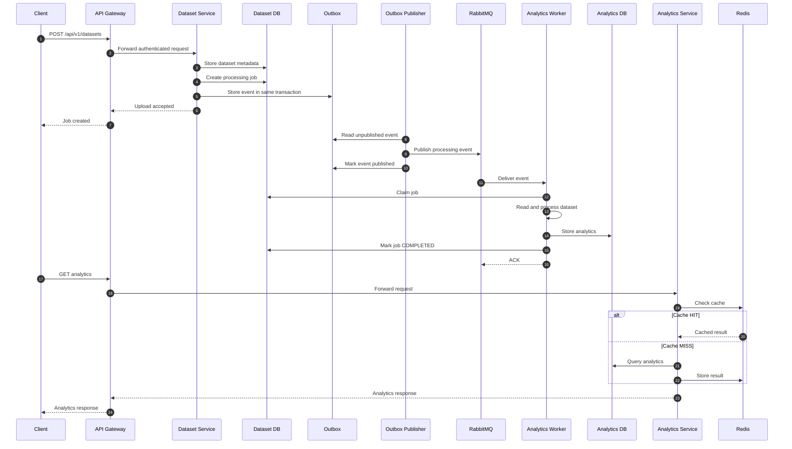
```mermaid
sequenceDiagram
    autonumber
    participant C as Client
    participant G as API Gateway
    participant D as Dataset Service
    participant DB as Dataset DB
    participant O as Outbox
    participant P as Outbox Publisher
    participant R as RabbitMQ
    participant W as Analytics Worker
    participant ADB as Analytics DB
    participant A as Analytics Service
    participant RC as Redis

    C->>G: POST /api/v1/datasets
    G->>D: Forward authenticated request
    D->>DB: Store dataset metadata
    D->>DB: Create processing job
    D->>O: Store event in same transaction
    D-->>G: Upload accepted
    G-->>C: Job created

    P->>O: Read unpublished event
    P->>R: Publish processing event
    P->>O: Mark event published

    R->>W: Deliver event
    W->>DB: Claim job
    W->>W: Read and process dataset
    W->>ADB: Store analytics
    W->>DB: Mark job COMPLETED
    W-->>R: ACK

    C->>G: GET analytics
    G->>A: Forward request
    A->>RC: Check cache

    alt Cache HIT
        RC-->>A: Cached result
    else Cache MISS
        A->>ADB: Query analytics
        A->>RC: Store result
    end

    A-->>G: Analytics response
    G-->>C: Analytics response
```

---

# Authentication and API Gateway

The API Gateway acts as the public entry point.

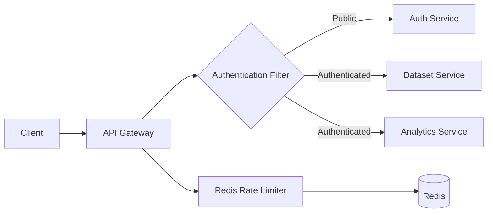
```mermaid
flowchart LR
    Client[Client] --> Gateway[API Gateway]
    Gateway --> Filter{Authentication Filter}

    Filter -->|Public| Auth[Auth Service]
    Filter -->|Authenticated| Dataset[Dataset Service]
    Filter -->|Authenticated| Analytics[Analytics Service]

    Gateway --> RateLimiter[Redis Rate Limiter]
    RateLimiter --> Redis[(Redis)]
```

## Public Routes

The authentication flow contains public endpoints such as:

- `POST /api/v1/auth/register`
- `POST /api/v1/auth/login`
- `POST /api/v1/auth/refresh`

## Protected Routes

Dataset and analytics routes require authentication:

- `/api/v1/datasets/**`
- `/api/v1/analytics/**`

The gateway validates the JWT before forwarding protected requests.

---

# Dataset Ingestion

Dataset upload should be treated as an ingestion operation rather than a processing operation.

The request is responsible for accepting the dataset and creating the processing state. Expensive analytics work happens asynchronously.

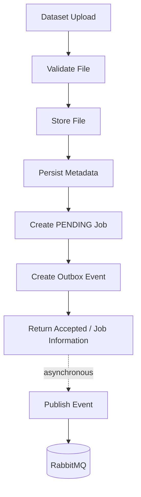
```mermaid
flowchart TD
    Upload[Dataset Upload] --> Validate[Validate File]
    Validate --> Store[Store File]
    Store --> Metadata[Persist Metadata]
    Metadata --> Job[Create PENDING Job]
    Job --> Event[Create Outbox Event]
    Event --> Response[Return Accepted / Job Information]

    Response -. asynchronous .-> Publish[Publish Event]
    Publish --> Queue[(RabbitMQ)]
```

### Processing Job Lifecycle

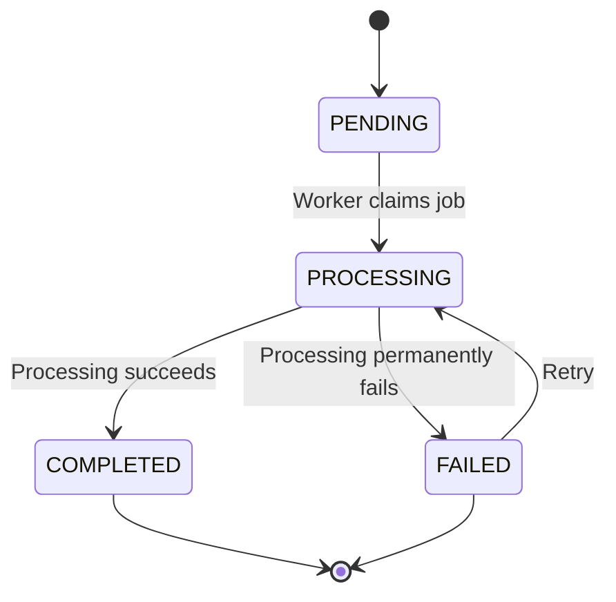
```mermaid
stateDiagram-v2
    [*] --> PENDING
    PENDING --> PROCESSING: Worker claims job
    PROCESSING --> COMPLETED: Processing succeeds
    PROCESSING --> FAILED: Processing permanently fails
    FAILED --> PROCESSING: Retry
    COMPLETED --> [*]
    FAILED --> [*]
```

---

# Transactional Outbox

The outbox pattern prevents a common distributed-system failure:

1. Dataset metadata is committed.
2. Event publication fails.
3. The database says the job exists, but no worker receives the event.

InsightFlow stores the event in an outbox table as part of the same database transaction as the dataset/job changes.

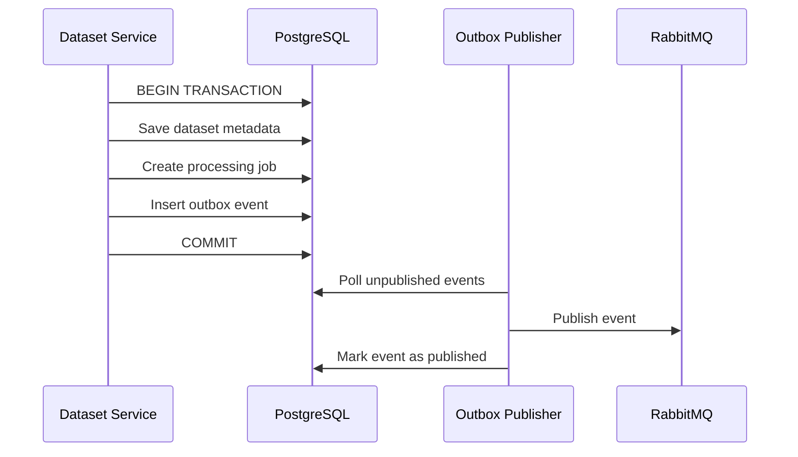
```mermaid
sequenceDiagram
    participant D as Dataset Service
    participant DB as PostgreSQL
    participant O as Outbox Publisher
    participant R as RabbitMQ

    D->>DB: BEGIN TRANSACTION
    D->>DB: Save dataset metadata
    D->>DB: Create processing job
    D->>DB: Insert outbox event
    D->>DB: COMMIT

    O->>DB: Poll unpublished events
    O->>R: Publish event
    O->>DB: Mark event as published
```

### Why This Matters

The database transaction guarantees that the job and its corresponding outbox event are persisted together.

The publisher can safely retry publication if RabbitMQ is temporarily unavailable.

---

# RabbitMQ Messaging

RabbitMQ provides asynchronous communication between dataset processing producers and workers.

A typical topology is:

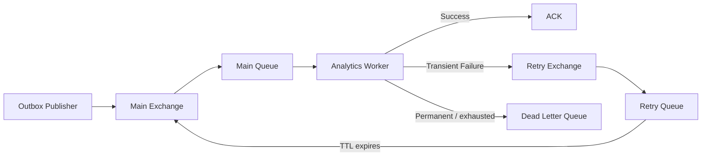
```mermaid
flowchart LR
    Publisher[Outbox Publisher]
    MainExchange[Main Exchange]
    MainQueue[Main Queue]
    Worker[Analytics Worker]

    Publisher --> MainExchange
    MainExchange --> MainQueue
    MainQueue --> Worker

    Worker -->|Success| Ack[ACK]
    Worker -->|Transient Failure| RetryExchange[Retry Exchange]
    RetryExchange --> RetryQueue[Retry Queue]
    RetryQueue -->|TTL expires| MainExchange
    Worker -->|Permanent / exhausted| DLQ[Dead Letter Queue]
```

## Message Identity

Each processing event should contain a stable event identifier.

Conceptually:

```text
event_id
dataset_id
job_id
event_type
attempt
created_at
```

The `event_id` is used by the consumer for idempotency.

---

# Idempotency

RabbitMQ provides at-least-once delivery semantics. A message can therefore be delivered more than once.

InsightFlow protects processing jobs from duplicate delivery.

## Job-Level Guard

A conditional update can ensure that only a pending job can be claimed:

```sql
UPDATE processing_jobs
SET status = 'PROCESSING'
WHERE id = ?
  AND status = 'PENDING';
```

If the update affects one row, the worker successfully claims the job.

If it affects zero rows, another worker or a previous delivery has already changed the state.

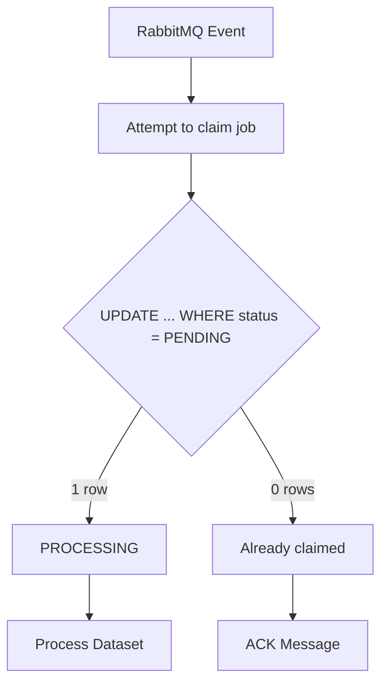
```mermaid
flowchart TD
    Event[RabbitMQ Event] --> Claim[Attempt to claim job]
    Claim --> Update{UPDATE ... WHERE status = PENDING}
    Update -->|1 row| Processing[PROCESSING]
    Update -->|0 rows| Duplicate[Already claimed]
    Duplicate --> Ack[ACK Message]
    Processing --> Work[Process Dataset]
```

## Event-Level Idempotency

A `processed_events` table can additionally enforce uniqueness:

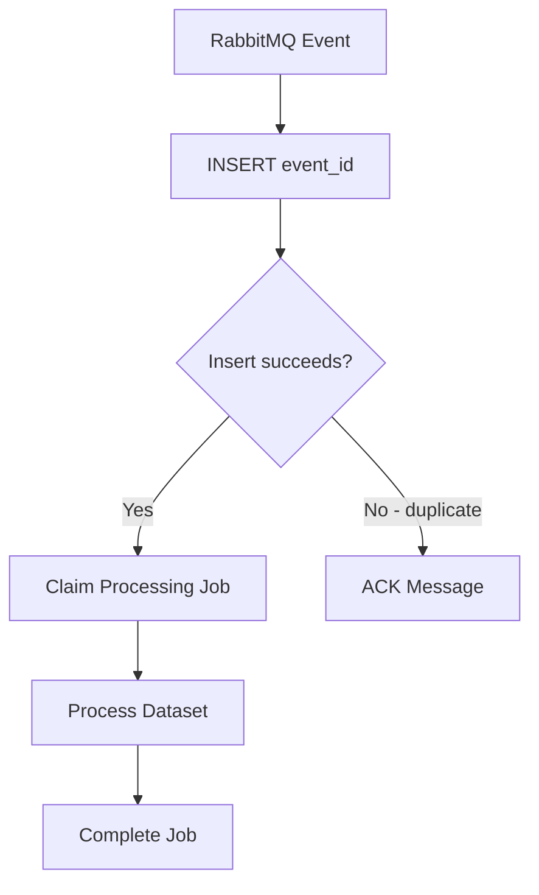
```mermaid
flowchart TD
    Event[RabbitMQ Event] --> Insert[INSERT event_id]
    Insert --> Result{Insert succeeds?}

    Result -->|Yes| Claim[Claim Processing Job]
    Result -->|No - duplicate| Ack[ACK Message]

    Claim --> Process[Process Dataset]
    Process --> Complete[Complete Job]
```

A database uniqueness constraint should back this guarantee:

```text
UNIQUE(event_id)
```

This makes the database the final authority for duplicate event detection.

---

# Retry and Dead-Letter Handling

Transient failures should not immediately mark a job as permanently failed.

The retry flow uses a retry queue with a TTL before returning the message to the main queue.

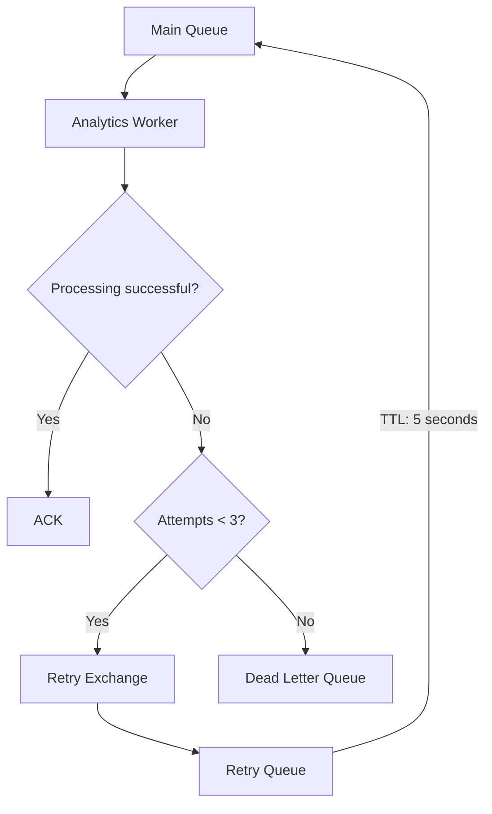
```mermaid
flowchart TD
    Main[Main Queue] --> Worker[Analytics Worker]
    Worker --> Success{Processing successful?}

    Success -->|Yes| Ack[ACK]
    Success -->|No| Attempts{Attempts < 3?}

    Attempts -->|Yes| RetryExchange[Retry Exchange]
    RetryExchange --> RetryQueue[Retry Queue]
    RetryQueue -->|TTL: 5 seconds| Main

    Attempts -->|No| DLQ[Dead Letter Queue]
```

### Retry Strategy

The documented configuration uses:

- Retry attempts: up to 3
- Retry queue TTL: 5 seconds
- Final failure: DLQ

The retry mechanism is intended for transient errors such as temporary infrastructure or dependency failures.

Permanent data errors should not be retried indefinitely.

---

# Analytics Processing

The analytics worker performs the expensive work outside the request thread.

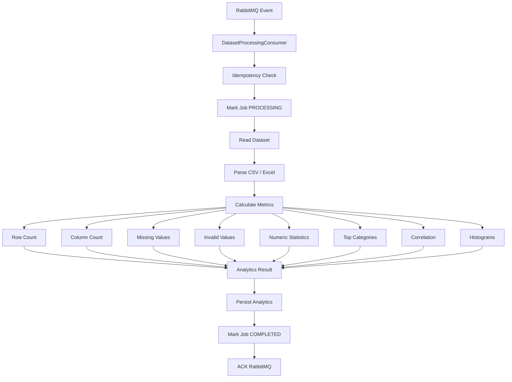
```mermaid
flowchart TD
    Event[RabbitMQ Event] --> Consumer[DatasetProcessingConsumer]
    Consumer --> Idempotency[Idempotency Check]
    Idempotency --> Claim[Mark Job PROCESSING]
    Claim --> Read[Read Dataset]
    Read --> Parse[Parse CSV / Excel]

    Parse --> Metrics[Calculate Metrics]
    Metrics --> Rows[Row Count]
    Metrics --> Columns[Column Count]
    Metrics --> Missing[Missing Values]
    Metrics --> Invalid[Invalid Values]
    Metrics --> Stats[Numeric Statistics]
    Metrics --> Categories[Top Categories]
    Metrics --> Correlation[Correlation]
    Metrics --> Histograms[Histograms]

    Rows --> Result[Analytics Result]
    Columns --> Result
    Missing --> Result
    Invalid --> Result
    Stats --> Result
    Categories --> Result
    Correlation --> Result
    Histograms --> Result

    Result --> Store[Persist Analytics]
    Store --> Complete[Mark Job COMPLETED]
    Complete --> Ack[ACK RabbitMQ]
```

## Processing Contract

The worker follows this high-level sequence:

1. Consume event.
2. Check/claim idempotency.
3. Mark job `PROCESSING`.
4. Read dataset from its storage path.
5. Parse records.
6. Calculate analytics.
7. Persist analytics result.
8. Mark job `COMPLETED`.
9. ACK the RabbitMQ message.

If processing fails, the message enters the retry flow instead of being acknowledged as successful.

---

# Data Quality

InsightFlow can expose basic data-quality metrics.

A simple model is:

```text
total cells = total rows × total columns

valid values =
    total cells - missing values - invalid values

quality score =
    (valid values / total cells) × 100
```

The important distinction is that **missing**, **invalid**, and **valid** values represent different data-quality states.

For row-level metrics, a separate definition should be used rather than directly applying the cell-level formula.

---

# Redis Caching

Analytics responses can be expensive to calculate or retrieve repeatedly.

Redis provides a cache-aside pattern:

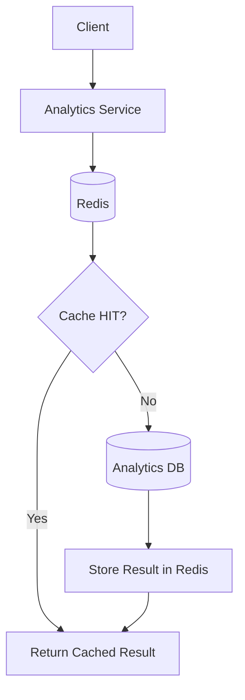
```mermaid
flowchart TD
    Client[Client] --> API[Analytics Service]
    API --> Redis[(Redis)]
    Redis --> Hit{Cache HIT?}

    Hit -->|Yes| Return[Return Cached Result]
    Hit -->|No| DB[(Analytics DB)]
    DB --> Store[Store Result in Redis]
    Store --> Return
```

## Cache-Aside Flow

1. Analytics API checks Redis.
2. On a hit, return the cached response.
3. On a miss, query the analytics database.
4. Store the result in Redis.
5. Return the result to the client.

Cache invalidation should occur whenever the underlying analytics result changes.

---

# Rate Limiting

The API Gateway uses Redis-backed rate limiting to protect services from excessive traffic.

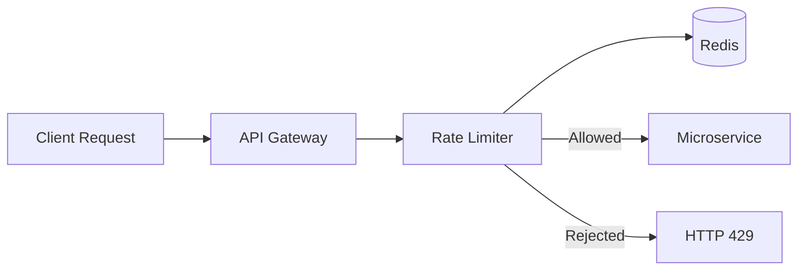
```mermaid
flowchart LR
    Client[Client Request] --> Gateway[API Gateway]
    Gateway --> Limiter[Rate Limiter]
    Limiter --> Redis[(Redis)]

    Limiter -->|Allowed| Service[Microservice]
    Limiter -->|Rejected| TooMany[HTTP 429]
```

This allows the gateway to reject excessive requests before they reach downstream services.

---

# Database Ownership

The platform separates database responsibilities by service.

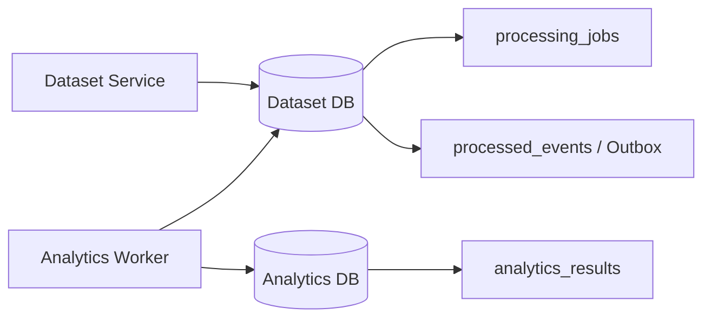
```mermaid
flowchart LR
    Dataset[Dataset Service] --> DatasetDB[(Dataset DB)]
    DatasetDB --> Jobs[processing_jobs]
    DatasetDB --> Events[processed_events / Outbox]

    Worker[Analytics Worker] --> DatasetDB
    Worker --> AnalyticsDB[(Analytics DB)]

    AnalyticsDB --> Results[analytics_results]
```

The supplied architecture describes two JPA data sources for the analytics worker:

```text
analytics-worker
├── dataset_db
│   ├── processing_jobs
│   └── processed_events
│
└── analytics_db
    └── analytics_results
```

### Ownership Model

| Component | Responsibility |
|---|---|
| Dataset DB | Dataset metadata and processing state |
| `processing_jobs` | Tracks processing lifecycle |
| `processed_events` | Prevents duplicate event processing |
| Analytics DB | Stores calculated analytics |
| Redis | Cache and rate-limiting state |

---

# API Reference

## Authentication

| Method | Endpoint | Purpose |
|---|---|---|
| `POST` | `/api/v1/auth/register` | Register a user |
| `POST` | `/api/v1/auth/login` | Authenticate a user |
| `POST` | `/api/v1/auth/refresh` | Refresh access token |

> The source documentation listed some authentication operations as `GET`. For standard REST semantics, login and token refresh are represented here as `POST`; verify the actual controller mappings before treating this table as the implementation contract.

## Dataset

| Method | Endpoint | Purpose |
|---|---|---|
| `POST` | `/api/v1/datasets` | Upload CSV/Excel |
| `GET` | `/api/v1/datasets/jobs` | Get current user's jobs |
| `GET` | `/api/v1/datasets/jobs/{jobId}` | Get a processing job |
| `GET` | `/api/v1/datasets/{datasetId}/download` | Download clean CSV |

## Analytics

| Method | Endpoint | Purpose |
|---|---|---|
| `GET` | `/api/v1/analytics/datasets/{datasetId}` | Complete analytics |
| `GET` | `/api/v1/analytics/datasets/{datasetId}/summary` | Dataset summary |
| `GET` | `/api/v1/analytics/datasets/{datasetId}/columns/{columnName}` | Column-level analytics |

---

# Project Structure

```text
InsightFlow/
├── api-gateway/
├── auth-service/
├── dataset-service/
├── analytics-worker/
└── analytics-service/
```

## Service Ownership

```text
Dataset Service
└── Owns dataset files, metadata, and processing-job lifecycle

Analytics Worker
└── Consumes events and processes datasets

Analytics Service
└── Exposes analytics and dashboard-oriented read APIs

Auth Service
└── Owns authentication and user identity

API Gateway
└── Routes requests and applies cross-cutting gateway policies
```

---

# Non-Functional Requirements

InsightFlow is designed around the following requirements:

### Scalability

Services and workers should be horizontally scalable.

Multiple analytics workers can consume messages from the same RabbitMQ queue.

### Eventual Consistency

Dataset ingestion and analytics generation are asynchronous, so the system is eventually consistent.

A newly uploaded dataset may initially have a `PENDING` or `PROCESSING` job before analytics become available.

### Fault Tolerance

Transient failures are handled using retries.

Repeated failures are isolated in a dead-letter queue.

### Idempotency

Duplicate messages must not result in duplicate processing.

The combination of event identity and job-state guards provides protection against duplicate deliveries.

### Rate Limiting

Redis-backed rate limiting protects public APIs and downstream services.

### Caching

Redis reduces repeated database reads for frequently requested analytics.

### Containerized Deployment

The platform is intended to run as a Dockerized microservices system.

---

# Failure Scenarios

## Database Commit Succeeds, RabbitMQ Is Temporarily Down

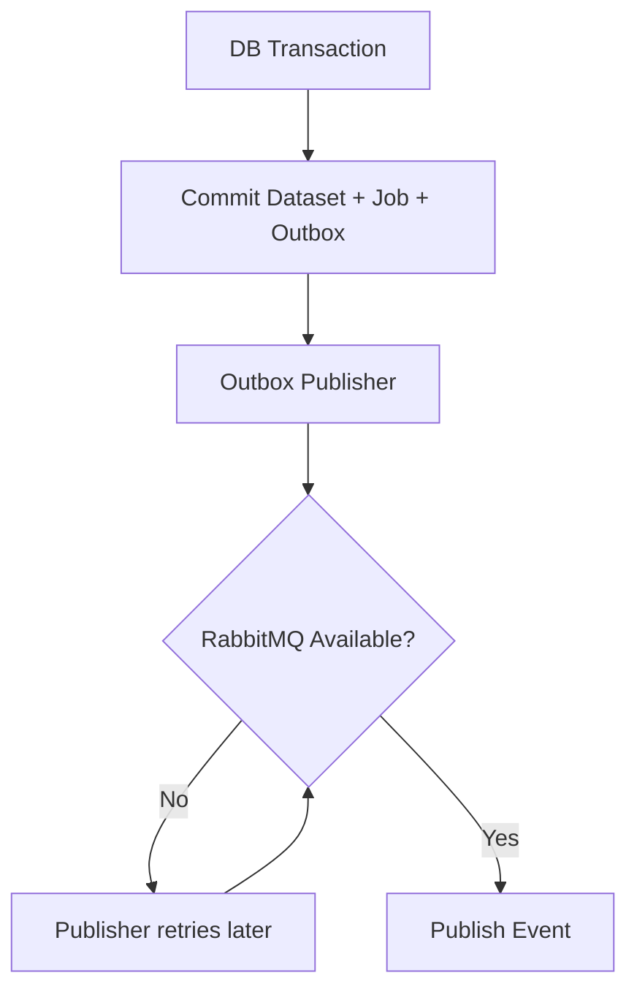
```mermaid
flowchart TD
    Transaction[DB Transaction] --> Commit[Commit Dataset + Job + Outbox]
    Commit --> Publisher[Outbox Publisher]
    Publisher --> RabbitMQ{RabbitMQ Available?}

    RabbitMQ -->|No| Retry[Publisher retries later]
    Retry --> RabbitMQ
    RabbitMQ -->|Yes| Publish[Publish Event]
```

The outbox event remains available until successful publication.

## Duplicate RabbitMQ Delivery

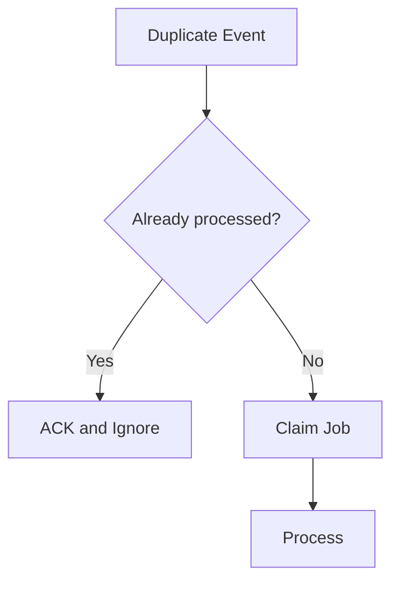
```mermaid
flowchart TD
    Event[Duplicate Event] --> Idempotency{Already processed?}
    Idempotency -->|Yes| Ack[ACK and Ignore]
    Idempotency -->|No| Claim[Claim Job]
    Claim --> Process[Process]
```

## Worker Failure During Processing

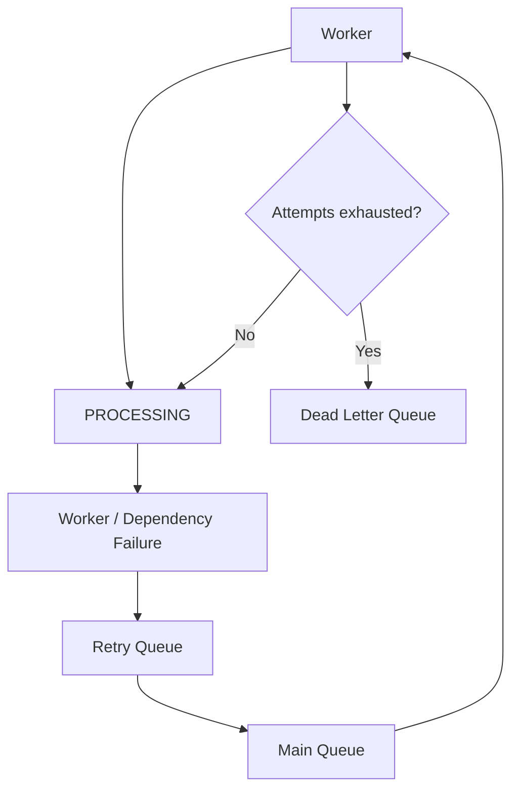
```mermaid
flowchart TD
    Worker[Worker] --> Processing[PROCESSING]
    Processing --> Failure[Worker / Dependency Failure]
    Failure --> Retry[Retry Queue]
    Retry --> Main[Main Queue]
    Main --> Worker
    Worker --> Attempts{Attempts exhausted?}
    Attempts -->|No| Processing
    Attempts -->|Yes| DLQ[Dead Letter Queue]
```

---

# Deployment

The platform is designed to be deployed as independent Dockerized services.

A production deployment should provide:

- API Gateway
- Auth Service
- Dataset Service
- Analytics Service
- Analytics Worker
- PostgreSQL
- Redis
- RabbitMQ

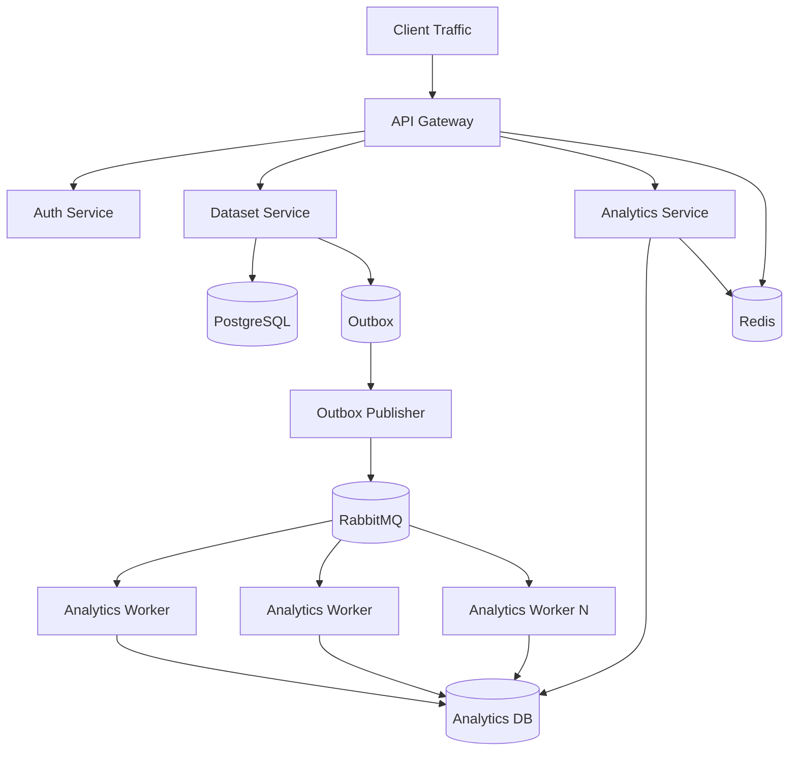
```mermaid
flowchart TB
    Internet[Client Traffic] --> Gateway[API Gateway]

    Gateway --> Auth[Auth Service]
    Gateway --> Dataset[Dataset Service]
    Gateway --> Analytics[Analytics Service]

    Dataset --> PostgreSQL[(PostgreSQL)]
    Dataset --> Outbox[(Outbox)]

    Outbox --> Publisher[Outbox Publisher]
    Publisher --> RabbitMQ[(RabbitMQ)]

    RabbitMQ --> Worker1[Analytics Worker]
    RabbitMQ --> Worker2[Analytics Worker]
    RabbitMQ --> WorkerN[Analytics Worker N]

    Worker1 --> AnalyticsDB[(Analytics DB)]
    Worker2 --> AnalyticsDB
    WorkerN --> AnalyticsDB

    Analytics --> AnalyticsDB
    Analytics --> Redis[(Redis)]
    Gateway --> Redis
```

## Horizontal Scaling

The analytics worker is the natural scaling point for CPU- and I/O-heavy dataset processing.

```mermaid
flowchart LR
    MQ[(RabbitMQ)] --> W1[Worker 1]
    MQ --> W2[Worker 2]
    MQ --> W3[Worker 3]
    MQ --> WN[Worker N]

    W1 --> DB[(Analytics DB)]
    W2 --> DB
    W3 --> DB
    WN --> DB
```

Additional workers can consume messages from the same queue, allowing processing throughput to increase without scaling the public API layer by the same amount.

---

# Design Summary

InsightFlow follows a clear separation of responsibilities:

```mermaid
flowchart LR
    Ingestion[Ingestion] --> Reliability[Reliability Layer]
    Reliability --> Messaging[Event Messaging]
    Messaging --> Processing[Async Processing]
    Processing --> Analytics[Analytics Storage]
    Analytics --> ReadAPI[Analytics API]
    ReadAPI --> Cache[Redis Cache]
    Cache --> Dashboard[Dashboard]
```

The core reliability chain is:

**Transactional Outbox → RabbitMQ → Idempotent Consumer → Retry → DLQ**

The core performance chain is:

**API Gateway → Async Processing → Horizontally Scaled Workers → Redis-Cached Analytics**

This architecture allows InsightFlow to accept large datasets without forcing clients to wait for expensive analytics processing to complete.
