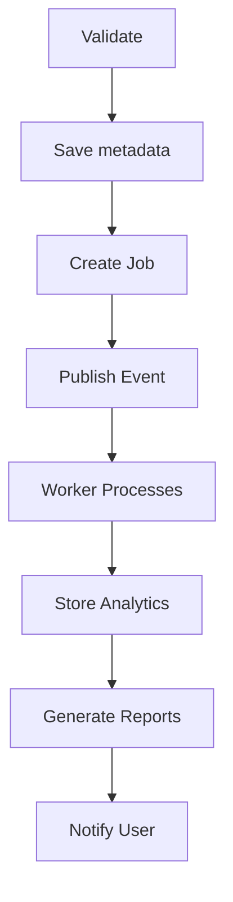
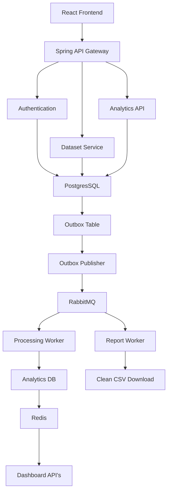

# InsightFlow

An Event-Driven Analytics Platform for Processing Large Datasets

## Tagline
"Upload. Process. Analyze. Scale."

## Problem Statement

Organizations frequently receive CSV/Excel files containing sales, employee, financial, or customer data. Processing these files synchronously leads to slow responses, poor scalability, duplicate processing, and failures when external systems are unavailable.

InsightFlow provides an asynchronous, reliable analytics platform that processes datasets using an event-driven architecture while ensuring reliability through idempotency, the transactional outbox pattern, retries, dead-letter queues, caching, and rate limiting.

## Functional Requirements

### Authentication
* Register
* Login
* JWT Authentication
* Refresh Token
* User Profile

### Dataset
* Upload CSV
* Upload Excel
* View uploaded datasets
* Delete dataset
* Dataset version
                  
### Processing
When a dataset is uploaded:


### Analytics
Generate
* Total rows
* Total columns
* Missing Values
* Duplicate Rows
* Numeric statistics
* Top categories
* Correlation
* Histograms
* Data quality score

### Reports
* PDF
* JSON
* Dashboard

### Notifications
* Processing started
* Completed
* Failed

### Dashboard
Show
* Uploaded datasets
* Processing jobs
* Queue status
* Failed jobs
* Completed reports

## Non Functional Requirements
* Horizontal Scaling
* Eventually consistent
* Fault Tolerance
* Retry support
* Idempotent uploads
* Rate limiting
* Dead letter queue
* Redis Caching
* Docker deployment



```text
UPDATE
WHERE id = ?
AND status = PENDING
```

## First delivery

```text 

DB:

PENDING
   │
   ▼
UPDATE ... WHERE status=PENDING
   │
   ▼
1 row updated
   │
   ▼
PROCESSING
```

## Duplicate delivery

```text

DB:

PROCESSING
   │
   ▼
UPDATE ... WHERE status=PENDING
   │
   ▼
0 rows updated

```


```text
Retry Exchange
      │
      ▼
Retry Queue
      │
      │ TTL = 5 seconds
      ▼
Main Exchange
      │
      ▼
Main Queue
```

## RabbitMQ message

```text
RabbitMQ message
       │
       ▼
Try INSERT event_id
       │
       ├── INSERT succeeds
       │       ↓
       │    First delivery
       │       ↓
       │    Process
       │
       └── INSERT fails (duplicate)
               ↓
          Already claimed
               ↓
             ACK
```


```text

              RabbitMQ Event
                    │
                    ▼
             processed_events
                    │
              event_id exists?
               /          \
             YES           NO
              │             │
              ▼             ▼
            ACK          Claim Event
             │              │
             │              ▼
             │       processing_jobs
             │              │
             │              ▼
             │        PENDING → PROCESSING
             │              │
             │              ▼
             │          Process CSV
             │
             ▼
           Ignore
```

```text
                       RabbitMQ
                          │
                          ▼
                     Main Queue
                          │
                          ▼
                    Analytics Worker
                          │
                          ▼
                  processed_events
                          │
                  UNIQUE(event_id)
                          │
              ┌───────────┴───────────┐
              │                       │
         New event                Duplicate
              │                       │
              ▼                       ▼
          Claim it                  ACK
              │
              ▼
         Processing Job
              │
              ▼
          Process CSV
```

### RabbitMQ topology

```text
                    ┌──────────────────────┐
                    │  Main Exchange       │
                    │  insightflow.dataset │
                    │  .exchange           │
                    └──────────┬───────────┘
                               │
                    dataset.processing.requested
                               │
                               ▼
                    ┌──────────────────────┐
                    │     Main Queue       │
                    └──────────┬───────────┘
                               │
                               ▼
                         Worker
                           │
                           Main Queue
                            ↓
                        Worker
                            ↓
                        FAIL
                            ↓
                        Retry 1
                            ↓
                        FAIL
                            ↓
                        Retry 2
                            ↓
                        FAIL
                            ↓
                        Retry 3
                            ↓
                         FAILURE
                           │
                           ▼
                    ┌──────────────────────┐
                    │  Retry Exchange      │
                    │  insightflow.dataset │
                    │  .retry.exchange     │
                    └──────────┬───────────┘
                               │
                    dataset.processing.retry
                               │
                               ▼
                              FAIL
                                  │
                      ┌───────────┴───────────┐
                      │                       │
                  attempts < 3            attempts >= 3
                      │                       │
                      ▼                       ▼
           ┌──────────────────────┐          DLQ
           │     Retry Queue      │
           │                      │
           │ TTL = 5 seconds      │
           └──────────┬───────────┘
                      │
                after 5 seconds
                      │
                      ▼
           Main Exchange
                      │
                      ▼
                Main Queue           

```

### Process the CSV

```text

RabbitMQ
   │
   ▼
DatasetProcessingConsumer
   │
   ├── 1. Claim/idempotency check
   │
   ├── 2. Mark job PROCESSING
   │
   ├── 3. Read CSV from storagePath
   │
   ├── 4. Parse rows
   │
   ├── 5. Calculate analytics
   │      ├── row count
   │      ├── column count
   │      ├── missing values
   │      ├── numeric statistics
   │      └── basic distributions
   │
   ├── 6. Store analytics result
   │
   ├── 7. Mark job COMPLETED
   │
   └── 8. ACK RabbitMQ message

```

## Redis

 ```text
 Client
   │
   ▼
API Gateway
   │
   ▼
Analytics API
   │
   ├── Check Redis
   │      │
   │      ├── HIT ──────► return cached result
   │      │
   │      └── MISS
   │            │
   │            ▼
   │        PostgreSQL
   │            │
   │            ▼
   │        Store in Redis
   │            │
   │            ▼
   │        Return result
 ```

### Why these three counts?

```text
total rows = missing + invalid + valid
```
#### A simple and explainable formula would be:

```text
valid values = total cells - missing values - invalid values

quality score =
(valid values / total cells) × 100
```


### Architecture

```text
                    ┌───────────────┐
                    │   API Gateway │
                    └───────┬───────┘
                            │
                            ▼
                    ┌───────────────┐
                    │ Dataset/API   │
                    │    Service    │
                    └───────┬───────┘
                            │
                            │ RabbitMQ
                            ▼
                    ┌───────────────┐
                    │   Analytics   │
                    │    Worker     │
                    └───────┬───────┘
                            │
              ┌─────────────┼─────────────┐
              ▼             ▼             ▼
          CSV Parser   Data Quality   Statistics
              │             │             │
              └─────────────┼─────────────┘
                            ▼
                    ┌───────────────┐
                    │ PostgreSQL    │
                    │ JSONB Result  │
                    └───────┬───────┘
                            │
                            ▼
                    Analytics API
                            │
                            ▼
                       Dashboard

```


## Insightflow services

```text
InsightFlow/
├── api-gateway/
├── auth-service/
├── dataset-service/
├── analytics-worker/
└── analytics-service/    
```
