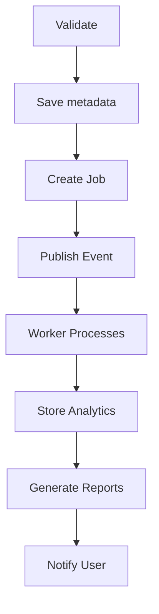
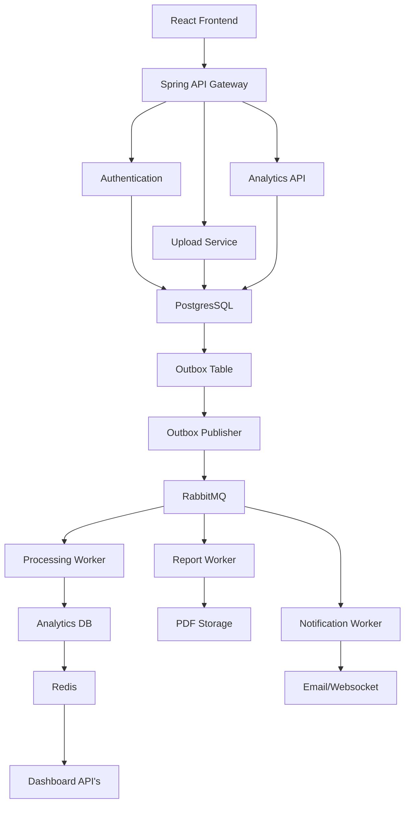

# InsightFlow

An Event-Driven Analytics Platform for Processing Large Datasets

## Tagline
"Upload. Process. Analyze. Scale."

## Problem Statement

Organizations frequently receive CSV/Excel files containing sales, employee, financial, or customer data. Processing these files synchronously leads to slow responses, poor scalability, duplicate processing, and failures when external systems are unavailable.

InsightFlow provides an asynchronous, reliable analytics platform that processes datasets using an event-driven architecture while ensuring reliability through idempotency, the transactional outbox pattern, retries, dead-letter queues, caching, and rate limiting.

## Functional Requirements

### Authentication
* Register
* Login
* JWT Authentication
* Refresh Token
* User Profile

### Dataset
* Upload CSV
* Upload Excel
* View uploaded datasets
* Delete dataset
* Dataset version
                  
### Processing
When a dataset is uploaded:

### Analytics
Generate
* Total rows
* Total columns
* Missing Values
* Duplicate Rows
* Numeric statistics
* Top categories
* Correlation
* Histograms
* Data quality score

### Reports
* PDF
* JSON
* Dashboard

### Notifications
* Processing started
* Completed
* Failed

### Dashboard
Show
* Uploaded datasets
* Processing jobs
* Queue status
* Failed jobs
* Completed reports

## Non Functional Requirements
* Horizontal Scaling
* Eventually consistent
* Fault Tolerance
* Retry support
* Idempotent uploads
* Rate limiting
* Dead letter queue
* Redis Caching
* Docker deployment

